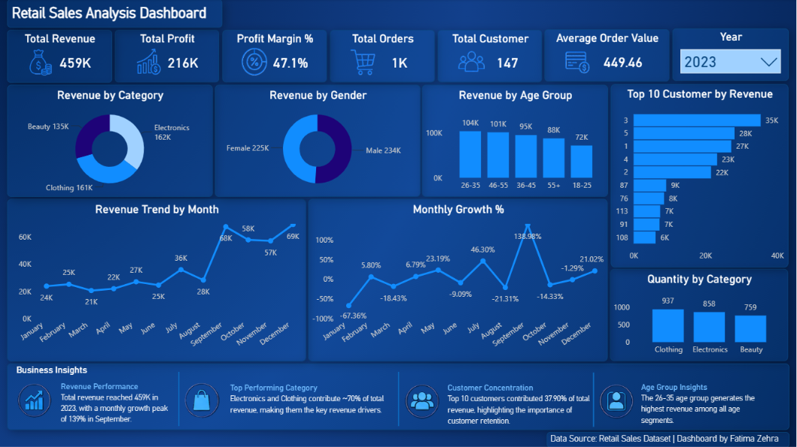

# Retail Sales Analysis | SQL & Power BI

## Project Overview
**Project Title:** Retail Sales Analysis

**Level:** Beginner to Intermediate

**Tools Used:** PostgreSQL, SQL, Power BI, Excel

**Database:** `p1_retail_db`


This project is designed to demonstrate SQL skills and techniques typically used by data analysts to explore, clean, and analyze retail sales data. The project involves setting up a retail sales database, performing exploratory data analysis (EDA), and answering specific business questions through SQL queries. This project is ideal for those who are starting their journey in data analysis and want to build a solid foundation in SQL.

## Business Scenario
Imagine you are a Data Analyst working for a retail company that wants to better understand customer purchasing behavior, product performance, and sales trends. Management requires insights that can help improve revenue generation, customer targeting, and business growth.

## Business Problem
**The company lacks visibility into:**
- High-performing product categories 
- Customer purchasing behavior 
- Revenue trends over time 
- Most valuable customers 
- Category profitability

## Project Objective
The objective of this project is to analyze retail sales transaction data using SQL to identify sales trends, customer purchasing behavior, product category performance, and revenue opportunities. The insights generated can help retail businesses make informed decisions regarding marketing strategies, customer targeting, inventory planning, and business growth.

## Tools & Technologies:
- PostgreSQL
- SQL
- Power BI
- Excel
- GitHub

## Dataset Information

The dataset used in this project contains retail sales transaction data. Each row represents a single customer purchase transaction and includes information about the customer, product category, quantity purchased, sales amount, and transaction date/time.

The dataset is used to analyze sales performance, customer purchasing behavior, product category trends, and profitability.

### Dataset Summary

| Attribute | Description |
|-----------|-------------|
| Total Records | 2,000 |
| Data Type | Retail Sales Transactions |
| Time Period | 2022–2023 |
| Number of Categories | 3 (Clothing, Beauty, Electronics) |
| Unique Customers | 155 |
| Database | PostgreSQL |

### Dataset Columns

| Column Name | Description |
|------------|-------------|
| transactions_id | Unique transaction identifier |
| sale_date | Date of purchase |
| sale_time | Time of purchase |
| customer_id | Unique customer identifier |
| gender | Customer gender |
| age | Customer age |
| category | Product category purchased |
| quantity | Number of items purchased |
| price_per_unit | Price per item |
| cogs | Cost of Goods Sold |
| total_sale | Total transaction value |

### Why This Dataset?

This dataset was chosen because it contains key retail sales attributes required for end-to-end SQL analysis, including customer demographics, product categories, transaction details, and sales information. It provides an opportunity to practice data cleaning, exploratory analysis, and business-focused problem solving using SQL.

## Project Structure

### 1. Database Setup

- **Database Creation**: The project starts by creating a database named `p1_retail_db`.
- **Table Creation**: A table named `retail_sales` is created to store the sales data. The table structure includes columns for transaction ID, sale date, sale time, customer ID, gender, age, product category, quantity sold, price per unit, cost of goods sold (COGS), and total sale amount.
```sql
CREATE DATABASE p1_retail_db;

CREATE TABLE retail_sales
(
    transactions_id INT PRIMARY KEY,
    sale_date DATE,	
    sale_time TIME,
    customer_id INT,	
    gender VARCHAR(10),
    age INT,
    category VARCHAR(35),
    quantity INT,
    price_per_unit FLOAT,	
    cogs FLOAT,
    total_sale FLOAT
);
```
### 2. Data Exploration & Cleaning

- **Record Count**: Determine the total number of records in the dataset.
- **Customer Count**: Find out how many unique customers are in the dataset.
- **Category Count**: Identify all unique product categories in the dataset.
- **Null Value Check**: Check for any null values in the dataset and delete records with missing data.

```sql
SELECT COUNT(*) FROM retail_sales;
SELECT COUNT(DISTINCT customer_id) FROM retail_sales;
SELECT DISTINCT category FROM retail_sales;

SELECT * FROM retail_sales
WHERE 
    sale_date IS NULL OR sale_time IS NULL OR customer_id IS NULL OR 
    gender IS NULL OR age IS NULL OR category IS NULL OR 
    quantity IS NULL OR price_per_unit IS NULL OR cogs IS NULL;

DELETE FROM retail_sales
WHERE 
    sale_date IS NULL OR sale_time IS NULL OR customer_id IS NULL OR 
    gender IS NULL OR age IS NULL OR category IS NULL OR 
    quantity IS NULL OR price_per_unit IS NULL OR cogs IS NULL;
```


## Key Business Questions Addressed

- Which product categories generated the highest revenue and profit?
- Which customer segments contributed the most to sales?
- Who were the top customers driving business revenue?
- How did revenue trends change over time?
- Which periods recorded the highest sales performance?
- What percentage of revenue depended on high-value customers?

## 3. SQL Analysis
    The following SQL queries were developed to answer specific business questions:


1. **How many sales transactions were recorded?**
```sql
SELECT COUNT(*) AS total_transaction FROM  retail_sales;
```

2. **How many unique customers made purchases?**
```sql
SELECT COUNT(DISTINCT customer_id) AS total_customer
FROM retail_sales;
```

3. **What is the total revenue generated from all sales?**
```sql
SELECT SUM(total_sale) AS total_revenue
FROM retail_sales;
```

4. **Which product category generated the highest revenue?**
```sql
SELECT category, SUM(total_sale) AS highest_revenue
FROM retail_sales
GROUP BY 1
ORDER BY 2 DESC
LIMIT 1;
```

5. **What is the average transaction value?**
```sql
SELECT ROUND(AVG(total_sale)::numeric,2) AS avg_transaction_value
FROM retail_sales;
```

6. **Which month generated the highest revenue in 2023?**
```sql
SELECT 
    EXTRACT(MONTH FROM sale_date ) AS month,
    -- EXTRACT(YEAR FROM sale_date ) AS year,
    SUM(total_sale) AS revenue
FROM retail_sales
WHERE EXTRACT(YEAR FROM sale_date )= '2023'
GROUP BY 1
ORDER BY 2 DESC
LIMIT 1;
```
7. **Which gender contributed the most to total revenue?**
```sql
SELECT 
    gender,
    SUM(total_sale) AS total_revenue
FROM retail_sales
GROUP BY 1
ORDER BY 2 DESC;

-- Supporting Analysis:
-- What is the minimum and maximum age of customers in the dataset?
SELECT 
    Min(age), 
    max(age) 
FROM retail_sales;
```
8. **Which customer age group spends the most?**
```sql
SELECT 
    CASE 
        WHEN age BETWEEN 18 AND 25 THEN '18-25'
        WHEN age BETWEEN 26 AND 35 THEN '26-35'
        WHEN age BETWEEN 36 AND 45 THEN '36-45'
        WHEN age BETWEEN 46 AND 55 THEN '46-55'
        ELSE '56+'
    END AS age_grp,
    SUM(total_sale)
FROM retail_sales
GROUP BY 1
ORDER BY 2 DESC;
```
9. **Which product category generates the highest profit?**
```sql
SELECT category ,
    SUM(total_sale - cogs) AS profit
FROM retail_sales
GROUP BY 1
ORDER BY 2 DESC;
```

10. **Which month had the highest average sales amount in each year?**
```sql
SELECT 
    month, 
    year, 
    avg_sale
FROM 
(   
    SELECT 
        EXTRACT(MONTH FROM sale_date) as month,
        EXTRACT(Year FROM sale_date) as year,
        AVG(total_sale) avg_sale,
        RANK() OVER(PARTITION BY EXTRACT(YEAR FROM sale_date) ORDER BY AVG(total_sale) DESC) AS rank_year
    FROM retail_sales
    GROUP BY 1, 2
    -- Limit 1
) as t1
WHERE rank_year = 1;
```

11. **Who are the top 10 customers based on total spending?**
```sql
SELECT 
    customer_id,
    SUM(total_sale) AS top_customers
FROM retail_sales
GROUP BY 1
ORDER BY 2 DESC
LIMIT 10;
```

12. **How do product categories rank based on total revenue generated?**
```sql
SELECT 
    category,
    SUM(total_sale) AS revenue,
    RANK() OVER(ORDER BY SUM(total_sale) DESC) AS category_rkn
FROM retail_sales
GROUP BY 1;
```

13. **What was the month-over-month revenue growth percentage?**
```sql
WITH monthly_sales AS( 
SELECT 
    EXTRACT(YEAR FROM sale_date) AS year,
    EXTRACT(MONTH FROM sale_date) AS month,
    SUM(total_sale) AS revenue
FROM retail_sales
GROUP BY 1, 2
),

sales_growth AS (
SELECT 
    month,
    year,
    revenue,
    LAG(revenue) OVER(
        ORDER BY year, month
    ) AS prev_revenue
FROM monthly_sales
)
SELECT 
    month,
    year, 
    revenue,
    prev_revenue,
    ROUND(
        (
            (revenue - prev_revenue )
            / prev_revenue * 100)::NUMERIC,
        2
    ) AS growth_percentage
FROM sales_growth;
```

14. **Which customers can be classified as high-value customers based on spending above the average customer spending?**
```sql
WITH customer_sales AS ( 
SELECT 
    customer_id,
    SUM(total_sale) AS spending
FROM retail_sales
GROUP BY 1
)

SELECT *
FROM customer_sales 
WHERE spending > ( 
    SELECT 
        AVG(spending)
    FROM customer_sales
    );
```

15. **What is the cumulative (running total) revenue over time?**
```sql
SELECT 
    sale_date,
    SUM(total_sale) AS daily_sales,
    SUM(SUM(total_sale))OVER(
        ORDER BY sale_date 
    )AS running_total
FROM retail_sales
GROUP BY 1;
```

16. **What percentage of total sales revenue was contributed by the top 10 customers?**
```sql
WITH top_10_customer AS(
	SELECT
		customer_id,
		SUM(total_sale) AS customer_total_sale
	FROM retail_sales
	GROUP BY 1
	ORDER BY 2 DESC
	LIMIT 10
),

overall_sale AS(
	SELECT
		SUM(total_sale) AS total_sale
	FROM retail_sales
)

SELECT 
	ROUND((SUM(t.customer_total_sale) * 100 / o.total_sale)::NUMERIC ,2)
	AS top_10_customer_percentage
FROM top_10_customer AS t
CROSS JOIN overall_sale AS o
GROUP BY o.total_sale;
```

## Power BI Dashboard

To complement the SQL analysis, an interactive Power BI dashboard was developed to visualize sales performance, customer behavior, category performance, and revenue trends.

### Dashboard Features

- KPI Tracking

  - Total Revenue
  - Total Profit
  - Profit Margin %
  - Total Orders
  - Total Customers
  - Average Order Value

- Revenue Trend Analysis

- Monthly Growth Analysis

- Top 10 Customer Analysis

- Category Performance Analysis

- Customer Demographic Analysis

- Business Insights & Recommendations

### Dashboard Preview



## Dashboard Insights (2023)

- Total revenue reached 459K with a profit of 216K.
- Electronics and Clothing generated 70.37% of total revenue, making them the primary revenue drivers.
- The top 10 customers contributed 37.90% of total revenue.
- The 26–35 age group generated the highest revenue among customer segments.
- Revenue growth peaked at 138.98% in September.

## Key Findings (2022–2023)

**Revenue Insights:**
- The business generated $911720 in total revenue during the analysis period.
- Electronics emerged as the highest revenue-generating category.
- December 2023 recorded the highest monthly revenue.

**Customer Insights:**
- The dataset included 155 unique customers.
- The 46-55 age group contributed the highest spending.
- Female customers generated slightly higher revenue than male customers.

**Profitability Insights:**
- clothing was the most profitable category.
- The top 10 customers contributed approximately 23.52% of total sales.
  
**Growth Insights:**
- Calculated the percentage change in monthly revenue compared to the previous month to identify sales trends and periods of growth or decline
- Cumulative revenue analysis indicated steady business expansion over time.

## Business Recommendations

- Focus marketing and inventory investments on Electronics and Clothing, as they account for the majority of revenue.
- Strengthen customer retention strategies for high-value customers, who contribute a significant share of total sales.
- Target the 26–35 customer segment with personalized campaigns and promotions.
- Monitor monthly revenue trends to identify seasonal opportunities and optimize inventory planning.
- Continue tracking category-level profitability to support product portfolio decisions.

## Conclusion
This project serves as a comprehensive introduction to SQL for data analysts, covering database setup, data cleaning, exploratory data analysis, and business-driven SQL queries. The findings from this project can help drive business decisions by understanding sales patterns, customer behavior, and product performance.

## Author - Fatima Zehra
- GitHub: https://github.com/Fatima-Zehra-DA
- LinkedIn: https://www.linkedin.com/in/your-linkedin-profile](https://linkedin.com/in/fatima-zehra-308b85358/


This project is part of my portfolio, showcasing the SQL skills essential for data analyst roles. If you have any questions, feedback, or would like to collaborate, feel free to get in touch!


